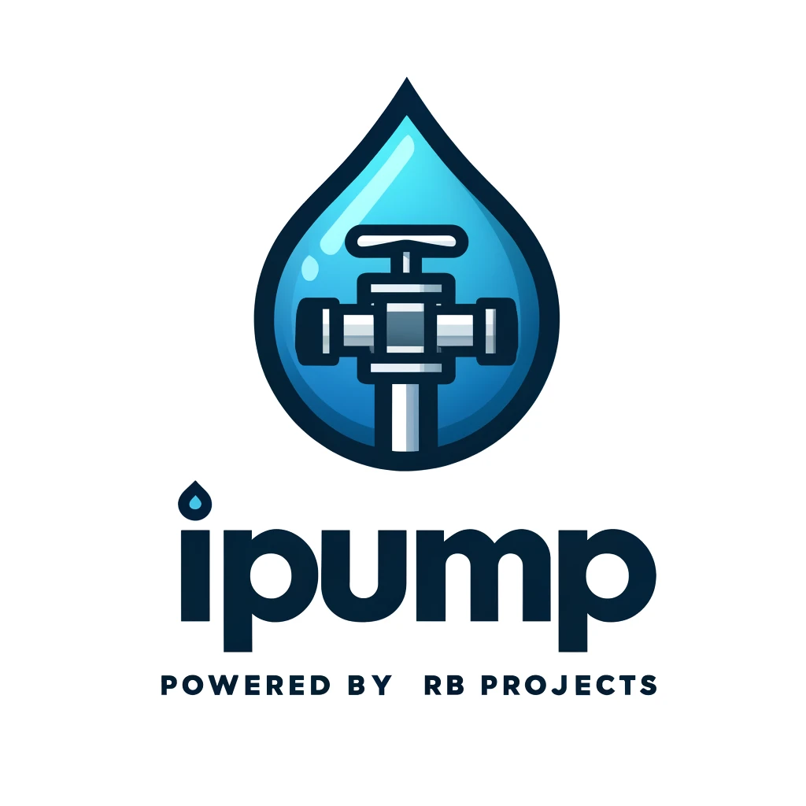

# Projeto: Controle de Bomba de Água com ESP32

## Descrição do Projeto

Este projeto utiliza um microcontrolador ESP32 para controlar uma bomba de água e duas válvulas solenóides, alternando entre duas caixas de água. O sistema possui os seguintes componentes e funcionalidades:

### Componentes Principais
- **ESP32**: Microcontrolador principal para gerenciamento do sistema.
- **Bomba de Água**: Controlada por um relé.
- **Válvulas Solenóides**: Controlam o fluxo de água para as duas caixas.
- **Caixas de Água**: Cada uma equipada com dois sensores de nível (crítico e cheio).
- **LEDs Indicadores**: Indicadores de modo de operação (automático/manual) e estados dos níveis de água.
- **Botões de Controle**: Permitem a alternância entre modos automático e manual, e controle manual da bomba e das válvulas.
- **Conectividade WiFi e MQTT**: Para controle remoto e monitoramento via interface web e integração com sistemas MQTT.

### Funcionalidades
- **Modo Automático**: A bomba e as válvulas são controladas automaticamente com base nos níveis de água das caixas.
- **Modo Manual**: Controle manual da bomba e das válvulas via botões ou interface web.
- **Interface Web**: Permite monitorar e controlar o sistema remotamente. Inclui páginas para controle manual, status do sistema e configurações de rede/MQTT.
- **MQTT**: Integração para controle e monitoramento remoto através de mensagens MQTT.

## Organização do Código

O código está dividido em duas principais tarefas para aproveitar os dois núcleos do ESP32:

1. **Tarefa de Controle** (Núcleo 0):
   - Gerencia o controle da bomba e das válvulas.
   - Verifica e alterna os modos de operação.
   - Atualiza os LEDs indicadores.

2. **Tarefa MQTT** (Núcleo 1):
   - Gerencia a conexão e comunicação MQTT.
   - Processa mensagens recebidas via MQTT para controle remoto.

## Instruções para Uso

1. **Configuração do WiFi**:
   - Atualize as credenciais do WiFi (`ssid` e `password`) no código para conectar o ESP32 à sua rede ou use a interface web para configurá-las.
   - As credenciais serão salvas na memória não volátil (NVS).

2. **Conexão MQTT**:
   - Configure o broker MQTT e os tópicos de controle no código ou através da interface web.

3. **Montagem do Hardware**:
   - Conecte os componentes ao ESP32 conforme descrito no código (pinos dos relés, sensores de nível, LEDs, etc.).

4. **Carregamento do Código**:
   - Carregue o código no ESP32 utilizando o Arduino IDE ou outra plataforma compatível.

5. **Acesso à Interface Web**:
   - Conecte-se à rede WiFi do ESP32 (`iPump-Access-Point`) e acesse a interface web através do endereço `http://ipump.local`.

6. **Uso da Interface Web**:
   - Controle manualmente a bomba e as válvulas através dos botões na interface web.
   - Visualize o status do sistema e altere as configurações de rede e MQTT conforme necessário.
